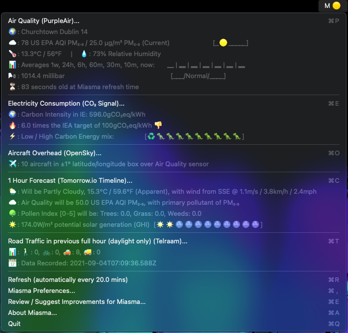
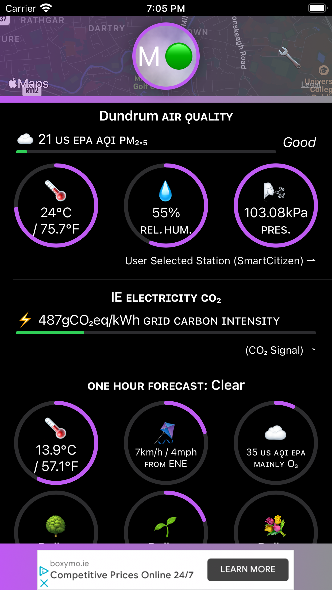

Miasma is an open source lightweight menu bar app for macOS & lightweight app for iOS that shows publicly available air quality data & potential pollution sources for your locality.
You can click the app if you want to see pertinent metrics, and on macOS the menu bar icon changes colour to match current PM₂.₅ conditions. 
The app updates its metrics every 20 minutes when you are online. 
The intention is that the user, by becoming periodically familar with how the data changes will become to see how different pollution sources interplay (weather, traffic, electrical generation, air quality etc.) - the user is the big data processor!
Data sourced from PurpleAir, WAQI/AQICN, SmartCitizen, CO2 Signal by TomorrowCo, OpenSky, ClimaCell & Telraam.

### Download

The app is distributed on the Apple Store (with automatic updates for when features are added), and also binaries & the source code are shared on GitHub for interested parties to review.

### Source Code
Source code is all shared here, as is, no warratnies, express or implied. APIKeys.swift is excluded, so if you are using the code, please create this file and list your own API key in it (you will see how they are referred to in the DataLoader files, in the URL section).
Project should open in Xcode.

### Data Sources
All data requests are sent directly, using HTTPS, to the data providers from your Mac or iPhone / iPad. Note that the data providers can see the ID of PurpleAir sensor you're interested in or the resultant coordinates, and your device's public IP address which can be unique to you depending on network configuration.

### Support
Please email me on miasma@kissengineering.ie or chat on Twitter @DarraghRogan - this is a side project for me so understand it may take me a couple of days to get back.

### About the name
Miasma is an obselete medical theory that bad vapours in the air caused sickness. Nowadays, with climate change caused by smoke being spread, maybe the theory isn't so obselete! See https://en.wikipedia.org/wiki/Miasma_theory

### Roadmap
#### Info
- Create a screensaver
- Bring all fuctionality to iOS app

#### Platform
- Widget for Mac OS
- Expand to Android & Windows

### Privacy Policy
Last updated September 13th, 2020
Thank you for choosing to be part of our community at Darragh Rogan (“Company”, “we”, “us”, or “our”). We are committed to protecting your personal information and your right to privacy. If you have any questions or concerns about this privacy notice, or our practices with regards to your personal information, please contact us at miasma@kissengineering.ie . When you use our application, as the case may be (the "App") and more generally, use any of our services (the "Services", which include the App), we appreciate that you are trusting us with your personal information. We take your privacy very seriously. In this privacy notice, we seek to explain to you in the clearest way possible what information we collect, how we use it and what rights you have in relation to it. We hope you take some time to read through it carefully, as it is important. If there are any terms in this privacy notice that you do not agree with, please discontinue use of our Services immediately.This privacy notice applies to all information collected through our Services (which, as described above, includes our App), as well as any related services, sales, marketing or events.Please read this privacy notice carefully as it will help you understand what we do with the information that we collect.

TABLE OF CONTENTS
1. WHAT INFORMATION DO WE COLLECT?
2. WILL YOUR INFORMATION BE SHARED WITH ANYONE?
3. IS YOUR INFORMATION TRANSFERRED INTERNATIONALLY?
4. HOW LONG DO WE KEEP YOUR INFORMATION?
5. HOW DO WE KEEP YOUR INFORMATION SAFE?
6. DO WE COLLECT INFORMATION FROM MINORS?
7. WHAT ARE YOUR PRIVACY RIGHTS?
8. CONTROLS FOR DO-NOT-TRACK FEATURES
9. DO CALIFORNIA RESIDENTS HAVE SPECIFIC PRIVACY RIGHTS?
10. DO WE MAKE UPDATES TO THIS NOTICE?
11. HOW CAN YOU CONTACT US ABOUT THIS NOTICE?

1 WHAT INFORMATION DO WE COLLECT?

2 HOW DO WE USE YOUR INFORMATION?
In Short:  We process your information for purposes based on legitimate business interests, the fulfillment of our contract with you, compliance with our legal obligations, and/or your consent.We use personal information collected via our App for a variety of business purposes described below. We process your personal information for these purposes in reliance on our legitimate business interests, in order to enter into or perform a contract with you, with your consent, and/or for compliance with our legal obligations. We indicate the specific processing grounds we rely on next to each purpose listed below.We use the information we collect or receive:
• Assessing usage of the app to improve it

3 WILL YOUR INFORMATION BE SHARED WITH ANYONE?
In Short:  We only share information with your consent, to comply with laws, to provide you with services, to protect your rights, or to fulfill business obligations.We may process or share your data that we hold based on the following legal basis:
• Consent: We may process your data if you have given us specific consent to use your personal information in a specific purpose.
• Legitimate Interests: We may process your data when it is reasonably necessary to achieve our legitimate business interests.
• Performance of a Contract: Where we have entered into a contract with you, we may process your personal information to fulfill the terms of our contract.
• Legal Obligations: We may disclose your information where we are legally required to do so in order to comply with applicable law, governmental requests, a judicial proceeding, court order, or legal process, such as in response to a court order or a subpoena (including in response to public authorities to meet national security or law enforcement requirements).
• Vital Interests: We may disclose your information where we believe it is necessary to investigate, prevent, or take action regarding potential violations of our policies, suspected fraud, situations involving potential threats to the safety of any person and illegal activities, or as evidence in litigation in which we are involved.More specifically, we may need to process your data or share your personal information in the following situations:
• Business Transfers. We may share or transfer your information in connection with, or during negotiations of, any merger, sale of company assets, financing, or acquisition of all or a portion of our business to another company.
• Business Partners. We may share your information with our business partners to offer you certain products, services or promotions. Specifically, see the data provider's privacy policy here too:
https://www2.purpleair.com/policies/privacy-policy
https://www.electricitymap.org/faq
https://opensky-network.org/index.php/about/privacy-policy
https://www.climacell.co/legal/product-privacy-policy/
https://support.google.com/ads/answer/1660762?visit_id=637382194546523804-3476093341&rd=1&co=GENIE.Platform%3DiOS&oco=0

4 IS YOUR INFORMATION TRANSFERRED INTERNATIONALLY?
In Short:  We may transfer, store, and process your information in countries other than your own. Our servers are located around the world. If you are accessing our App from outside, please be aware that your information may be transferred to, stored, and processed by us in our facilities and by those third parties with whom we may share your personal information (see "WILL YOUR INFORMATION BE SHARED WITH ANYONE?" above), in and other countries.If you are a resident in the European Economic Area, then these countries may not necessarily have data protection laws or other similar laws as comprehensive as those in your country. We will however take all necessary measures to protect your personal information in accordance with this privacy notice and applicable law.

5 HOW LONG DO WE KEEP YOUR INFORMATION?
In Short:  We keep your information for as long as necessary to fulfill the purposes outlined in this privacy notice unless otherwise required by law.We will only keep your personal information for as long as it is necessary for the purposes set out in this privacy notice, unless a longer retention period is required or permitted by law (such as tax, accounting or other legal requirements). No purpose in this notice will require us keeping your personal information for longer than 90 days.When we have no ongoing legitimate business need to process your personal information, we will either delete or anonymize such information, or, if this is not possible (for example, because your personal information has been stored in backup archives), then we will securely store your personal information and isolate it from any further processing until deletion is possible.

6 HOW DO WE KEEP YOUR INFORMATION SAFE?
In Short:  We aim to protect your personal information through a system of organizational and technical security measures.We have implemented appropriate technical and organizational security measures designed to protect the security of any personal information we process. However, despite our safeguards and efforts to secure your information, no electronic transmission over the Internet or information storage technology can be guaranteed to be 100% secure, so we cannot promise or guarantee that hackers, cybercriminals, or other unauthorized third parties will not be able to defeat our security, and improperly collect, access, steal, or modify your information. Although we will do our best to protect your personal information, transmission of personal information to and from our App is at your own risk. You should only access the App within a secure environment.

7 DO WE COLLECT INFORMATION FROM MINORS?
In Short:  We do not knowingly collect data from or market to children under 18 years of age.We do not knowingly solicit data from or market to children under 18 years of age. By using the App, you represent that you are at least 18 or that you are the parent or guardian of such a minor and consent to such minor dependent’s use of the App. If we learn that personal information from users less than 18 years of age has been collected, we will deactivate the account and take reasonable measures to promptly delete such data from our records. If you become aware of any data we may have collected from children under age 18, please contact us at miasma@kissengineering.ie .

8 WHAT ARE YOUR PRIVACY RIGHTS?
In Short:  You may review, change, or terminate your account at any time.If you are resident in the European Economic Area and you believe we are unlawfully processing your personal information, you also have the right to complain to your local data protection supervisory authority. You can find their contact details here: http://ec.europa.eu/justice/data-protection/bodies/authorities/index_en.htm. If you are resident in Switzerland, the contact details for the data protection authorities are available here: https://www.edoeb.admin.ch/edoeb/en/home.html.

9 CONTROLS FOR DO-NOT-TRACK FEATURES
Most web browsers and some mobile operating systems and mobile applications include a Do-Not-Track (“DNT”) feature or setting you can activate to signal your privacy preference not to have data about your online browsing activities monitored and collected. At this stage, no uniform technology standard for recognizing and implementing DNT signals has been finalized. As such, we do not currently respond to DNT browser signals or any other mechanism that automatically communicates your choice not to be tracked online. If a standard for online tracking is adopted that we must follow in the future, we will inform you about that practice in a revised version of this privacy notice.

10 DO CALIFORNIA RESIDENTS HAVE SPECIFIC PRIVACY RIGHTS?
In Short:  Yes, if you are a resident of California, you are granted specific rights regarding access to your personal information.California Civil Code Section 1798.83, also known as the “Shine The Light” law, permits our users who are California residents to request and obtain from us, once a year and free of charge, information about categories of personal information (if any) we disclosed to third parties for direct marketing purposes and the names and addresses of all third parties with which we shared personal information in the immediately preceding calendar year. If you are a California resident and would like to make such a request, please submit your request in writing to us using the contact information provided below.If you are under 18 years of age, reside in California, and have a registered account with the App, you have the right to request removal of unwanted data that you publicly post on the App. To request removal of such data, please contact us using the contact information provided below, and include the email address associated with your account and a statement that you reside in California. We will make sure the data is not publicly displayed on the App, but please be aware that the data may not be completely or comprehensively removed from all our systems (e.g. backups, etc.).  

11 DO WE MAKE UPDATES TO THIS NOTICE?
In Short:  Yes, we will update this notice as necessary to stay compliant with relevant laws.We may update this privacy notice from time to time. The updated version will be indicated by an updated “Revised” date and the updated version will be effective as soon as it is accessible. If we make material changes to this privacy notice, we may notify you either by prominently posting a notice of such changes or by directly sending you a notification. We encourage you to review this privacy notice frequently to be informed of how we are protecting your information.

12 HOW CAN YOU CONTACT US ABOUT THIS NOTICE?
If you have questions or comments about this notice, you may email us at miasma@kissengineering.ie or by post to:
Darragh Rogan, Dublin 14, Ireland

HOW CAN YOU REVIEW, UPDATE, OR DELETE THE DATA WE COLLECT FROM YOU?
Based on the applicable laws of your country, you may have the right to request access to the personal information we collect from you, change that information, or delete it in some circumstances. To request to review, update, or delete your personal information, please submit a request form by clicking here. We will respond to your request within 30 days.
This privacy policy was created using Termly’s Privacy Policy Generator.
